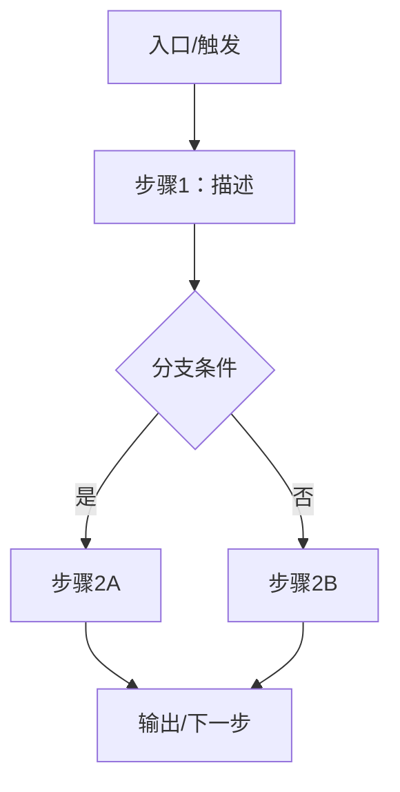

# 产品规划阶段SKILL

## 目的
- 聚焦大功能的核心场景分析与里程碑规划，形成可执行的规划与范围
- 通过2–3版方案对比与推荐，为取舍与排期提供依据
- 输出按端分表的功能清单（功能模块/功能名称/详细描述/用户价值/优先级），用于后续每个模块的需求分析与设计

## 适用时机
- 产品规划、MVP边界确定、方案评审与路线图对齐阶段

## 使用方式
- 触发场景：用于规划/MVP/方案评审请求；当需要对“大功能”的核心场景与里程碑进行规划时调用
- 开始方式：先给出三点信息——我需要什么产品（产品名称/业务域）、给谁用（主要用户/角色）、核心场景是什么（1–3个场景摘要）；随后进入“先ASK澄清、再产出”的流程
- 口令：
  - “澄清完成/继续”：在确认无未澄清项且系统已向用户发起询问后，收到该指令方可进入步骤1
  - “确认可行/继续”：完成步骤1–6后触发归档文档生成
  - “调整”：返回指定步骤更新
  - “暂停”：保存当前输出，等待后续指令
- 不自动调用其他技能；原型/验收等需在确认后单独调用

## 输入参数（必填）
- 产品名称、目标用户（Persona）
- 项目目标：3条量化目标（含优先级模型）
- 核心场景：1–3个
- 约束：合规/资源/技术/时间
- 竞品参考、北极星指标（纳入必填）

## 输出总览
- 2–3版可行性方案：每版含方案内容（功能模块+简要功能描述）、设计思路、方案亮点
- 方案对比与推荐：采用RICE标准评分与决策规则
- 核心场景流程图：Mermaid模板
- 里程碑规划：MVP→试点→扩展的阶段骨架与门禁模板
- 按端分表的功能清单（仅Markdown，不导出CSV）：学校端/监管端/家长端/供应商端

## 流程与产出

### 0. 前置问题澄清（必做）
- 逐项收集并确认：项目基本信息、用户与角色、核心场景与边界、不做项、合规与数据口径、依赖与风险、交付窗口与里程碑
- 记录：答案与时间戳纳入归档
- 完成度要求：当系统检测到“无待澄清问题”时，必须主动向用户发起询问并明确请求指令；仅在收到“澄清完成/继续”等明确口令后进入步骤1

### 1. 需求背景与用户价值分析
- 背景与问题陈述、约束（合规/资源/时间）
- Persona与关键痛点/动机
- 用户价值与衡量指标（量化）
- 项目目标与优先级（RICE/MoSCoW/ICE中选；本技能默认RICE）

### 2. 核心场景分析
- 选择1–3个核心场景，覆盖主路径与关键异常/边缘
- 输出：场景列表与任务节点（JTBD驱动）

### 3. 核心场景流程图
- Mermaid模板（示例）：

### 4. 2–3版可行性方案
- 每版结构
  - 方案内容（功能总览）：按模块罗列功能与简要描述
  - 设计思路：信息架构/导航、交互主线、反馈与异常策略
  - 方案亮点：可用性/效率/一致性/扩展性/易实施
- 方案A/B/C模板（略同，按需填充）

#### 方案对比表（RICE评分）
| 方案 | 范围摘要 | 架构/实现要点 | 价值 | 成本 | 风险 | 合规 | 交付可行性 | RICE评分 | 推荐结论 |
|---|---|---|---|---|---|---|---|---:|---|
| A | … | … | 高 | 中 | 低 | 满足 | 高 |  | 备选/推荐 |
| B | … | … | 中 | 低 | 中 | 满足 | 中 |  | 备选/不推荐 |
| C | … | … | 高 | 高 | 中 | 存疑 | 低 |  | 不推荐 |
- RICE口径：评分=Reach×Impact×Confidence ÷ Effort（标准公式）
- 决策规则：
  - 合规为硬约束，不满足直接排除
  - RICE最高且关键路径可用、交付可行者为首选
  - 评分接近时优先低风险、依赖少、里程碑清晰的方案
  - 不采纳方案需给出原因与缓解策略

#### 推荐结论与理由（位于对比之后）
- 输出“推荐方案与理由”文本，作为进入里程碑与功能清单的确认依据

### 5. 里程碑规划（MVP→试点→扩展）
- 阶段命名建议：V1-MVP / V2-试点 / V3-扩展
- 每阶段模板字段（门禁与记录）：
  - 阶段目标（量化）
  - 验收标准（门禁条件）
  - 关键依赖（系统/数据/资源）
  - 风险与缓解（触发条件与策略）
  - 触发条件（进入/退出）

### 6. 表格式功能清单（仅Markdown，按端分表）
- 端列表：学校端/监管端/家长端/供应商端（可根据实际扩展/裁剪）
- 展示方式：每端均以Markdown表格展示，列为五项——功能模块 | 功能名称 | 详细描述 | 用户价值 | 优先级（P0/P1/P2）
#### 示例：学校端
| 功能模块 | 功能名称 | 功能描述（支持xxx） | 用户价值 |
|---|---|---|---|
| 账户 | 登录与认证 | 支持密码+短信双因子登录 | 提升安全与合规 |
| 权限 | 角色与访问控制 | 支持角色-资源细粒度授权与审计 | 提升精确授权与可追溯 |

#### 示例：监管端
| 功能模块 | 功能名称 | 功能描述（支持xxx） | 用户价值 |
|---|---|---|---|
| 监督 | 审计与抽查 | 支持按学校、账期、科目抽查与留痕 | 提升透明与可追溯 |
| 发布 | 科目版本发布 | 支持版本审批、发布、生效期与冻结期 | 保证合规统一 |

- 用途：作为后续逐模块需求分析与设计的基线

## 确认与归档
- 完成步骤1–6后，等待口令“确认可行/继续”
- 收到后生成规划归档Markdown：仅含四项（背景与价值、核心场景分析、流程图、最终确认方案的功能清单）

## 协作原则
- 术语一致；不提前写稿；一次只做一个规划任务；不自动调用其他技能
